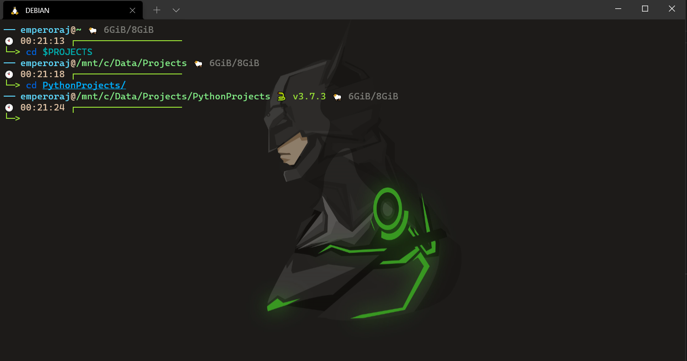

# DOTFILES

My current dotfiles, and yes, that's WSL.
I hate switching between windows and linux again and again to do coding, and then some of the softwares natively available only on windows. I could use wine, but upon benchmarking, my gpu was way slower in linux compared to windows, so, I started using WSL (windows subsystem for linux), and the experience has been great so far. 

